# Skill Library Reference Architecture

A tool-agnostic reference architecture for AI skill libraries that need to grow
without loading every capability into every model context.

> **Public alpha:** this repository is available for inspection and trial use.
> Its schemas and CLI may change; no release, tag, or package is published.

[](https://github.com/jremick/skill-library-reference-architecture/actions/workflows/validate.yml)
[](LICENSE)
[](#current-status)

<p align="center">
  
</p>

## What this is

This repository provides contracts, examples, diagrams, and a small reference
validator/compiler for managing skill libraries across four architecture levels:

| Level | Shape | Use it while |
| --- | --- | --- |
| 0 | Flat, simple skill set | The complete visible surface meets measured context and quality budgets. |
| 1 | Static domain routers and a deterministic compiler | Stable task domains compress the visible surface without increasing routing misses. |
| 2 | Filtered catalog, search, inspect, and exact activation | Metadata pressure or semantic overlap makes static routing insufficient. |
| 3 | Retrieval-served policy, telemetry, evaluation, and lifecycle controls | Dynamic catalogs, trust boundaries, or higher-risk actions require governed runtime controls. |

These are migration options, not a maturity contest. Promotion is driven by
configured evidence—context share, routing quality, permission complexity,
latency, drift, task outcomes, and rollback readiness—not a universal number of
skills.

The core value is separating what exists from what is visible, retrievable,
inspected, activated, and measured. See the
progression below for the public-facing story.

<p align="center">
  
</p>

## The common levels in practice

Level 1 and Level 2 are the usual working shapes once a flat library starts to
need more control. Both keep leaf skill bodies out of the initial prompt and
activate an exact skill only after selection. The difference is how they find
that leaf.

### Level 1: route stable domains

Level 1 compiles a small prompt-visible set of domain routers. Deterministic
aliases and keyword rules select an exact off-prompt leaf; ambiguous requests
stop for clarification.

<p align="center">
  
</p>

Follow the [complete Level 1 fixture](examples/level-1-static-router/), its
[router map](examples/level-1-static-router/router-map.yaml), and its
[profile](examples/level-1-static-router/profile.yaml). The example routes to
the synthetic [`table-analysis` skill](examples/level-1-static-router/skills/table-analysis/SKILL.md)
or [`code-review` skill](examples/level-1-static-router/skills/code-review/SKILL.md).

### Level 2: filter, search, and inspect

Level 2 keeps the catalog off prompt and applies profile and permission denials
before search or model ranking. A small candidate set can then be ranked and
inspected, but model judgment cannot restore a denied skill.

<p align="center">
  
</p>

Follow the [complete Level 2 fixture](examples/level-2-retrieval/), its
[retrieval map](examples/level-2-retrieval/router-map.yaml), and its
[standard profile](examples/level-2-retrieval/profile.yaml). Its synthetic
skills include [`deployment-review`](examples/level-2-retrieval/skills/deployment-review/SKILL.md),
[`document-summary`](examples/level-2-retrieval/skills/document-summary/SKILL.md),
and [`table-analysis`](examples/level-2-retrieval/skills/table-analysis/SKILL.md).
The [`deployment-runner` skill](examples/level-2-retrieval/skills/deployment-runner/SKILL.md)
shows a mutating leaf that the standard profile removes before retrieval.

The levels and contracts describe the target architecture for a conforming
implementation. They do not imply that the alpha `skillref` CLI implements a
host runtime. The current CLI validates repository documents, compiles a
profile-filtered catalog, and evaluates deterministic routing selection,
rejection, and exposure over synthetic cases. Host compatibility, trust
attestation, instruction or resource loading, activation, execution, telemetry
collection, behavioral outcomes, and promotion decisions require separate host
or adapter evidence.

## Core lifecycle

The reference model keeps these states distinct:

<p align="center">
  
</p>

Installed does not mean visible. Inspected does not mean activated. Activating a
skill does not imply that every bundled reference, script, or asset was loaded
or executed.

## Quick start: use this with your AI assistant

This repository is designed to be read by an AI assistant as well as a human.
Give the assistant access to the repository, then start with this prompt:

```text
Read this repository as a tool-agnostic reference architecture for my AI skill
library. Start with AGENTS.md, docs/architecture/levels.md, docs/migration.md,
and the Level 1 and Level 2 examples.

1. Inventory my current skills without copying private prompts, credentials,
   machine paths, integrations, or proprietary configuration into your answer.
2. Keep installed/cache, registered, eligible, prompt-visible,
   router-retrievable, inspected, activated, and conditionally loaded states
   distinct.
3. Recommend the smallest suitable architecture level using evidence from my
   library's context pressure, domain stability, semantic overlap, permissions,
   routing quality, and rollback needs. Do not use a universal skill-count
   threshold.
4. Show how my library would map into the repository's manifest, registry,
   router, profile, evaluation, and migration contracts.
5. Draft a staged adoption plan with verification, stop conditions, and a
   last-known-good rollback path. Do not modify my system until I approve it.
```

Choose the nearest starting point:

- **Level 1 — stable domains:** read the [Level 1 architecture](docs/architecture/levels.md#level-1-static-routing-compiler),
  [synthetic fixture](examples/level-1-static-router/),
  [router map](examples/level-1-static-router/router-map.yaml), and
  [profile](examples/level-1-static-router/profile.yaml). Inspect the
  [`table-analysis`](examples/level-1-static-router/skills/table-analysis/SKILL.md)
  and [`code-review`](examples/level-1-static-router/skills/code-review/SKILL.md)
  leaves to see exact routing and conditional resources in practice.
- **Level 2 — overlapping or growing catalog:** read the
  [Level 2 architecture](docs/architecture/levels.md#level-2-filtered-catalog-retrieval),
  [synthetic fixture](examples/level-2-retrieval/),
  [retrieval map](examples/level-2-retrieval/router-map.yaml), and
  [standard profile](examples/level-2-retrieval/profile.yaml). Compare the
  allowed [`deployment-review`](examples/level-2-retrieval/skills/deployment-review/SKILL.md)
  leaf with the denied
  [`deployment-runner`](examples/level-2-retrieval/skills/deployment-runner/SKILL.md)
  to see filter-before-ranking in practice.
- **Incorporating the architecture:** use the [migration guide](docs/migration.md),
  [canonical contracts](spec/README.md), and [ecosystem adapters](adapters/)
  after choosing a level.

### Optional: validate the reference repository locally

Prerequisites: Git, [uv](https://docs.astral.sh/uv/), and Python 3.10 or newer.

```bash
git clone https://github.com/jremick/skill-library-reference-architecture.git
cd skill-library-reference-architecture
uv sync --locked
uv run skillref validate .
uv run python -m unittest discover -s tests -v
```

To compile a synthetic Level 2 profile after validation:

```bash
uv run skillref compile examples/level-2-retrieval \
  --profile standard \
  --output .artifacts/level-2-standard.json
```

Generated bundles are derived evidence. Edit manifests, registries, router maps,
or profiles instead of hand-editing compiled output.

## Documentation

- [Architecture](docs/architecture/README.md) — levels, contracts, and lifecycle.
- [Compatibility](docs/compatibility.md) — portable core and ecosystem adapters.
- [Security model](docs/security-model.md) — trust boundaries and fail-closed policy.
- [Evaluation](docs/evaluation.md) — deterministic routing checks and the
  evidence required for broader host evaluation.
- [Migration](docs/migration.md) — evidence-led movement between levels.
- [Specification](spec/README.md) — normative contract index.
- [Synthetic examples](examples/) — Level 0 through Level 3 fixtures.

## Deterministic controls and model judgment

In the normative architecture, deterministic code owns schema validation,
exact IDs and references, hard policy, conflict rules, lifecycle transitions,
digests, redaction, and release gates. Models may help interpret intent,
rerank already eligible candidates, review semantic overlap, and assess
qualitative output. Trust and compatibility filters are deterministic only
after an adapter supplies verified attributes as canonical inputs; the current
compiler does not independently attest either one.

The alpha CLI implements only a subset of those deterministic responsibilities.
Its routing evaluator measures selection, rejection, and exposure; lifecycle
execution and behavioral quality require evidence from the named host runtime.

A model decision cannot override a hard denial or convert missing evidence into
a passing result.

## Current status

This repository is in **public alpha** for inspection and trial use.
The following are expected to change before beta:

- Schema fields and compatibility rules.
- CLI command and report formats.
- Retrieval and routing-evaluation reference implementations.
- Adapter conventions as vendor products evolve.
- Telemetry event names while relevant external conventions remain unstable.

This repository does not claim that its examples prove real-world usability,
security, routing quality, or compatibility outside the tested fixtures.
`governance/promotion-policy.yaml` is a configurable reference checklist, not
an executable promotion engine or evidence that any deployment has passed its
gates.

A preserved one-shot independent candidate evaluation failed its strict gates:
it found a Level 0 false activation and included lifecycle/resource assertions
that the routing-only evaluator cannot establish. The development and held-out
suites pass, but they are not independent acceptance evidence. See the
[independent candidate record](evals/independent-candidate-v2/README.md) for the
unaltered input digest, recorded metrics, preservation limits, and claim limits.

There is no release, tag, package, stable compatibility promise, or host-runtime
implementation in this alpha.

## Community and support

- [Issues](https://github.com/jremick/skill-library-reference-architecture/issues) — reproducible bugs, documentation problems, and bounded architecture proposals.
- [Contributing](CONTRIBUTING.md) — setup, tests, privacy rules, and change expectations.
- [Security policy](SECURITY.md) — report vulnerabilities privately.

There is no guaranteed response time during alpha. General agent-tool support and
private environment troubleshooting are outside this repository's scope.

## License

Licensed under the [Apache License 2.0](LICENSE). Copyright 2026 Jarel Remick.
